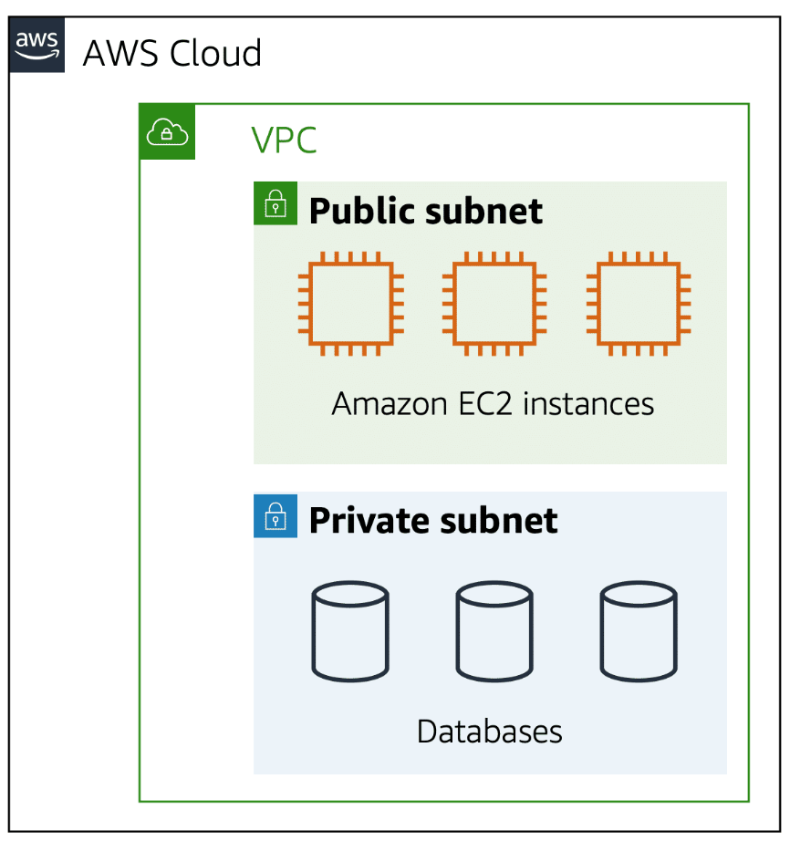
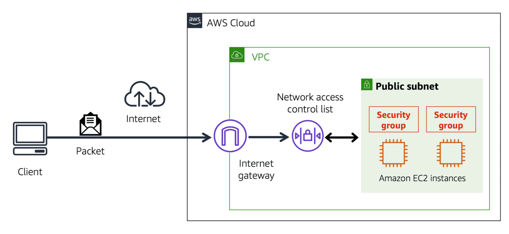

### AWS Certified cloud practitioner - ( CLF - C02 )  

### What is server composed of ?
- Compute : CPU
- Memory : RAM
- Storage: database
- Networks : Router, switches, Dns server.    

### IT Terminology
- Network: cables, routers and servers connected with each other
- Router: A networking device that forwards data packets between computer
networks. They know where to send your packets on the internet!
- Switch: Takes a packet and send it to the correct server / client on your network

### Problems with traditional IT approach
- Pay for the rent for the data center
- Pay for power supply, cooling, maintenance
- Adding and replacing hardware takes time
- Scaling is limited
- Hire 24/7 team to monitor the infrastructure
- How to deal with disasters? (earthquake, power shutdown, fire…)

### What is Cloud Computing?
- Cloud computing is the on-demand delivery of compute power, database storage,
applications, and other IT resources
- Through a cloud services platform with pay-as-you-go pricing
- You can provision exactly the right type and size of computing resources you
need
- You can access as many resources as you need, almost instantly
- Simple way to access servers, storage, databases and a set of application services

### The Five Characteristics of Cloud Computing?
- On-demand self service: Users can provision resources and use them without human interaction from the service
provider
- Broad network access: Resources available over the network, and can be accessed by diverse client platforms
- Multi-tenancy and resource pooling: 
  - Multiple customers can share the same infrastructure and applications with security and privacy
  - Multiple customers are serviced from the same physical resources
- Rapid elasticity and scalability:
  - Automatically and quickly acquire and dispose resources when needed
  - Quickly and easily scale based on demand
- Measured service: Usage is measured, users pay correctly for what they have used

### AWS Global Infrastructure
- AWS Regions 
  - AWS has Regions all around the world
  - Names can be us-east-1, eu-west-3…
  - Most AWS services are region-scoped
  - Each region has many availability zones (usually 3, min is 3, max is 6).
- AWS Availability Zones
  - Each availability zone (AZ) is one or more discrete data centers with redundant power, networking, and connectivity
  - They’re separate from each other, so that they’re isolated from disasters
  - They’re connected with high bandwidth, ultra-low latency networking
- AWS Data Centers 
- AWS Edge Locations / Points of Presence

### IAM ( Identity and Access Management )
- It is a global service. 
- Root account created by default, shouldn’t be used or shared
- Users are people within your organization, and can be grouped
- Groups only contain users, not other groups
- Users don’t have to belong to a group, and user can belong to multiple groups

### IAM: Permissions
- Users or Groups can be assigned JSON documents called policies
- These policies define the permissions of the users
- In AWS you apply the least privilege principle: don’t give more permissions than a user needs


### commands
```
// To configure
aws configure

// To list users
aws iam list-users

// To ssh into linux EC2 instances ( make sure u r in EC2Tutorial.pem directory )
ssh -i EC2Tutorial.pem ec2-user@<public-ip>

// To make EC2Tutorial.pem publicly available ( 400 protects it by making it read only and only for the owner )
chmod 400 EC2Tutorial.pem
```

### IAM Roles
- If a service in AWS needs to do work in another AWS service, a role is required
- If services in AWS need to talk to each other to accomplish a task, they need to have roles assigned.
- It is assigned to applications or services. 
- You cannot attach a role to an IAM user. You can attach the role to other AWS services like Ec2. 

### EC2 instances
- Sure! Let's imagine Amazon Web Services (AWS) as a magical playground where you can create and play with virtual computers called EC2 instances.
- Think of an EC2 instance like a toy computer in this magical playground. Each instance has its own special features, just like different toys have unique abilities. 
- For example, let's say you have a toy called "Tiger Instance". This instance is super fast and powerful, just like a tiger! You can use it to run apps or websites that need a lot of speed.
- Then there's another toy called "Elephant Instance". It's big and strong, just like an elephant! This one has lots of storage space, so you can store a ton of pictures or videos on it.
- Now, to play with these toys, you need a special place in the playground called a "Dedicated Host". Think of it like having your own play table where only your toys can play. No one else can use this table except you.
- But wait, what if you already have your own toy computer at home? No worries! You can bring it to the playground and still play with it. This is like bringing your own software licenses from home to use on the toys in the playground.
- And guess what? AWS even helps you manage your toys and keep them organized with something called "AWS License Manager". It's like having a magical assistant to help you keep track of your toys and make sure everything is running smoothly.
- So, in simple terms, EC2 instances in AWS are like magical toy computers that you can play with in a special playground. You can choose different types of instances based on what you need, and AWS helps you manage them so you can focus on having fun!

### Amazon EC2 Instance Types
- General purpose instances :
  - It's provide a balance of compute, memory, and networking resources.
  - For application in which the resource needs for compute, memory, and networking are roughly equivalent. 

- Compute optimized instances :
  - Ideal for compute-bound applications that benefit from high-performance processors.
  - The difference is compute optimized applications are ideal for high-performance web servers, compute-intensive applications servers, and dedicated gaming servers.

- Memory optimized instances :
  - Designed to deliver fast performance for workloads that process large datasets in memory.  
  - In computing, memory is a temporary storage area. It holds all the data and instructions that a central processing unit (CPU) needs to be able to complete actions.
  - Suppose that you have a workload that requires large amounts of data to be preloaded before running an application. This scenario might be a high-performance database or a workload that involves performing real-time processing of a large amount of unstructured data. 

- Accelerated computing instances :
  - Instances use hardware accelerators, or coprocessors, to perform some functions more efficiently than is possible in software running on CPUs. Examples of these functions include floating-point number calculations, graphics processing, and data pattern matching.

- Storage optimized instances :
  - designed for workloads that require high, sequential read and write access to large datasets on local storage
  - Examples of workloads suitable for storage optimized instances include distributed file systems, data warehousing applications, and high-frequency online transaction processing (OLTP) systems.
  - In computing, the term input/output operations per second (IOPS) is a metric that measures the performance of a storage device. It indicates how many different input or output operations a device can perform in one second. Storage optimized instances are designed to deliver tens of thousands of low-latency, random IOPS to applications.   


### Amazon EC2 pricing
- On-Demand Instances :
  - Ideal for short-term, irregular workloads that cannot be interrupted. No upfront costs or minimum contracts apply. The instances run continuously until you stop them, and you pay for only the compute time you use.

- Reserved Instances :
   - You can purchase Standard Reserved and Convertible Reserved Instances for a 1-year or 3-year term. You realize greater cost savings with the 3-year option.
   - There are two available types of Reserved Instances: 
     - Standard Reserved Instances :
        - This option is a good fit if you know the EC2 instance type and size you need for your steady-state applications and in which AWS Region you plan to run them.
        - Reserved Instances require you to state the following qualifications:
          1) Instance type and size: For example, m5.xlarge
          2) Platform description (operating system): For example, Microsoft Windows Server or Red Hat Enterprise Linux
          3) Tenancy: Default tenancy or dedicated tenancy
     - Convertible Reserved Instances :
         - If you need to run your EC2 instances in different Availability Zones or different instance types, then Convertible Reserved Instances might be right for you.    

- EC2 Instance Savings Plans :
  - EC2 Instance Savings Plans reduce your EC2 instance costs when you make an hourly spend commitment to an instance family and Region for a 1-year or 3-year term. This term commitment results in savings of up to 72 percent compared to On-Demand rates. Any usage up to the commitment is charged at the discounted Savings Plans rate (for example, $10 per hour). Any usage beyond the commitment is charged at regular On-Demand rates.

- Spot Instances :
  - ideal for workloads with flexible start and end times, or that can withstand interruptions. Spot Instances use unused Amazon EC2 computing capacity and offer you cost savings at up to 90% off of On-Demand prices.

- Dedicated Hosts :
  - physical servers with Amazon EC2 instance capacity that is fully dedicated to your use. 
  - Of all the Amazon EC2 options that were covered, Dedicated Hosts are the most expensive.


### Amazon EC2 Auto Scaling
- It enables you to automatically add or remove Amazon EC2 instances in response to changing application demand.
- By adding Amazon EC2 Auto Scaling to an application, you can add new instances to the application when necessary and terminate them when no longer needed.
- When you create an Auto Scaling group, you can set the minimum number of Amazon EC2 instances. The minimum capacity is the number of Amazon EC2 instances that launch immediately after you have created the Auto Scaling group.
- Next, you can set the desired capacity at two Amazon EC2 instances even though your application needs a minimum of a single Amazon EC2 instance to run.
- The third configuration that you can set in an Auto Scaling group is the maximum capacity. For example, you might configure the Auto Scaling group to scale out in response to increased demand, but only to a maximum of four Amazon EC2 instances.
 
### Elastic Load Balancing
- AWS service that automatically distributes incoming application traffic across multiple resources, such as Amazon EC2 instances. 
- A load balancer acts as a single point of contact for all incoming web traffic to your Auto Scaling group. This means that as you add or remove Amazon EC2 instances in response to the amount of incoming traffic, these requests route to the load balancer first. Then, the requests spread across multiple resources that will handle them. For example, if you have multiple Amazon EC2 instances, Elastic Load Balancing distributes the workload across the multiple instances so that no single instance has to carry the bulk of it. 

### Monolithic applications and microservices
- Suppose that you have an application with tightly coupled components. These components might include databases, servers, the user interface, business logic, and so on. This type of architecture can be considered a monolithic application. 
- In this approach to application architecture, if a single component fails, other components fail, and possibly the entire application fails.
- In a microservices approach, application components are loosely coupled. In this case, if a single component fails, the other components continue to work because they are communicating with each other. The loose coupling prevents the entire application from failing. 

### Amazon Simple Notification Service (Amazon SNS)
- It is a publish/subscribe service
- Using Amazon SNS topics, a publisher publishes messages to subscribers.
- In Amazon SNS, subscribers can be web servers, email addresses, AWS Lambda functions, or several other options. 

### Amazon Simple Queue Service (Amazon SQS)
- It is a message queuing service. 
- Using Amazon SQS, you can send, store, and receive messages between software components, without losing messages or requiring other services to be available. In Amazon SQS, an application sends messages into a queue. A user or service retrieves a message from the queue, processes it, and then deletes it from the queue.


### Serverless computing
- The term “serverless” means that your code runs on servers, but you do not need to provision or manage these servers.
- With serverless computing, you can focus more on innovating new products and features instead of maintaining servers.
- Another benefit of serverless computing is the flexibility to scale serverless applications automatically. 
- An AWS service for serverless computing is AWS Lambda.

### AWS Lambda
- AWS Lambda is a service that lets you run code without needing to provision or manage servers. 
- While using AWS Lambda, you pay only for the compute time that you consume. Charges apply only when your code is running. 
- For example, a simple Lambda function might involve automatically resizing uploaded images to the AWS Cloud. In this case, the function triggers when uploading a new image. 

### How AWS Lambda works
- You upload your code to Lambda. 
- You set your code to trigger from an event source, such as AWS services, mobile applications, or HTTP endpoints.
- Lambda runs your code only when triggered.
- You pay only for the compute time that you use. In the previous example of resizing images, you would pay only for the compute time that you use when uploading new images. Uploading the images triggers Lambda to run code for the image resizing function.

### Containers in AWS
- Containers provide you with a standard way to package your application's code and dependencies into a single object.
- You can also use containers for processes and workflows in which there are essential requirements for security, reliability, and scalability.
- Container orchestration services help you to deploy, manage, and scale your containerized applications.
- Two services that provide container orchestration: Amazon Elastic Container Service and Amazon Elastic Kubernetes Service.
   - Amazon Elastic Container Service (Amazon ECS): 
     - It is a highly scalable, high-performance container management system that enables you to run and scale containerized applications on AWS.
     - Amazon ECS supports Docker containers. Docker is a software platform that enables you to build, test, and deploy applications quickly. 
   - Amazon Elastic Kubernetes Service (Amazon EKS) :
     - It is a fully managed service that you can use to run Kubernetes on AWS.    
     - Kubernetes is open-source software that enables you to deploy and manage containerized applications at scale.
- AWS Fargate : 
  - It is a serverless compute engine for containers. It works with both Amazon ECS and Amazon EKS. 
  - When using AWS Fargate, you do not need to provision or manage servers. AWS Fargate manages your server infrastructure for you. You can focus more on innovating and developing your applications, and you pay only for the resources that are required to run your containers.


### Selecting a Region
- compliance : Depending on your company and location, you might need to run your data out of specific areas. For example, if your company requires all of its data to reside within the boundaries of the UK, you would choose the London Region. 
- Proximity : Selecting a Region that is close to your customers will help you to get content to them faster.
- Feature availability : Sometimes, the closest Region might not have all the features that you want to offer to customers. AWS is frequently innovating by creating new services and expanding on features within existing services. However, making new services available around the world sometimes requires AWS to build out physical hardware one Region at a time. 
- pricing : Several factors determine pricing, but for now know that the cost of services can vary from Region to Region.

### Edge locations
- An edge location is a site that Amazon CloudFront uses to store cached copies of your content closer to your customers for faster delivery.
- CDNs are commonly used, and on AWS, we call our CDN Amazon CloudFront. 
- Amazon CloudFront is a service that helps deliver data, video, applications, and APIs to customers around the world with low latency and high transfer speeds. Amazon CloudFront uses what are called Edge locations, all around the world, to help accelerate communication with users, no matter where they are. 
- Edge locations are separate from Regions, so you can push content from inside a Region to a collection of Edge locations around the world, in order to accelerate communication and content delivery.
- AWS Edge locations, also run more than just CloudFront. They run a domain name service, or DNS, known as Amazon Route 53, helping direct customers to the correct web locations with reliably low latency.

### AWS Elastic Beanstalk
- With AWS Elastic Beanstalk, you provide code and configuration settings, and Elastic Beanstalk deploys the resources necessary to perform the following tasks:
  - Adjust capacity
  - Load balancing
  - Automatic scaling
  - Application health monitoring
- AWS Elastic Beanstalk is a deployment service offered by Amazon Web Services (AWS) that simplifies the process of deploying and managing web applications in the cloud. It eliminates the need to manually provision and configure underlying infrastructure, allowing you to focus on your application code.  

### AWS CloudFormation
- With AWS CloudFormation, you can treat your infrastructure as code.
- CloudFormation uses templates written in JSON or YAML to define the AWS resources you need for your application. These templates specify the resources (like EC2 instances, S3 buckets, etc.) and their configurations. This approach allows for version control, collaboration, and easier replication of your infrastructure.
- This means that you can build an environment by writing lines of code instead of using the AWS Management Console to individually provision resources.
- AWS CloudFormation provisions your resources in a safe, repeatable manner, enabling you to frequently build your infrastructure and applications without having to perform manual actions.
- It determines the right operations to perform when managing your stack and rolls back changes automatically if it detects errors.

### AWS Outposts
- AWS Outposts is a service provided by Amazon Web Services (AWS) that extends the AWS infrastructure, services, APIs, and tools to customers' on-premises data centers or co-location spaces. Essentially, it brings the power and flexibility of the AWS cloud to your own physical location.


### AWS virtual private cloud
- Amazon VPC enables you to provision an isolated section of the AWS Cloud. 
- In this isolated section, you can launch resources in a virtual network that you define. 
- Within a virtual private cloud (VPC), you can organize your resources into subnets.
- A subnet is a section of a VPC that can contain resources such as Amazon EC2 instances. 
- Internet gateway
  - To allow public traffic from the internet to access your VPC, you attach an internet gateway to the VPC.
  - An internet gateway is a connection between a VPC and the internet. 
  - You can think of an internet gateway as being similar to a doorway that customers use to enter the coffee shop. Without an internet gateway, no one can access the resources within your VPC.
- Virtual private gateway
  - To access private resources in a VPC, you can use a virtual private gateway. 
  - Here’s an example of how a virtual private gateway works. You can think of the internet as the road between your home and the coffee shop. Suppose that you are traveling on this road with a bodyguard to protect you. You are still using the same road as other customers, but with an extra layer of protection. 
  - The bodyguard is like a virtual private network (VPN) connection that encrypts (or protects) your internet traffic from all the other requests around it. 
  - The virtual private gateway is the component that allows protected internet traffic to enter into the VPC. Even though your connection to the coffee shop has extra protection, traffic jams are possible because you’re using the same road as other customers. 
  - A virtual private gateway enables you to establish a virtual private network (VPN) connection between your VPC and a private network, such as an on-premises data center or internal corporate network.
- AWS Direct Connect
  - AWS Direct Connect is a service that lets you to establish a dedicated private connection between your data center and a VPC.
  - Suppose that there is an apartment building with a hallway directly linking the building to the coffee shop. Only the residents of the apartment building can travel through this hallway. 
  - This private hallway provides the same type of dedicated connection as AWS Direct Connect. Residents are able to get into the coffee shop without needing to use the public road shared with other customers.   


### Subnets
- A subnet is a section of a VPC in which you can group resources based on security or operational needs. Subnets can be public or private.
- Public subnets contain resources that need to be accessible by the public, such as an online store’s website.
- Private subnets contain resources that should be accessible only through your private network, such as a database that contains customers’ personal information and order histories. 
- In a VPC, subnets can communicate with each other. For example, you might have an application that involves Amazon EC2 instances in a public subnet communicating with databases that are located in a private subnet.



### Network ACLs ( network access control list )
- When a customer requests data from an application hosted in the AWS Cloud, this request is sent as a packet. A packet is a unit of data sent over the internet or a network. 
- It enters into a VPC through an internet gateway. Before a packet can enter into a subnet or exit from a subnet, it checks for permissions. These permissions indicate who sent the packet and how the packet is trying to communicate with the resources in a subnet.
- The VPC component that checks packet permissions for subnets is a network access control list (ACL).
- A network ACL is a virtual firewall that controls inbound and outbound traffic at the subnet level.
- Each AWS account includes a default network ACL. When configuring your VPC, you can use your account’s default network ACL or create custom network ACLs. 
- By default, your account’s default network ACL allows all inbound and outbound traffic, but you can modify it by adding your own rules.
- For custom network ACLs, all inbound and outbound traffic is denied until you add rules to specify which traffic to allow.
- Network ACLs perform stateless packet filtering. They remember nothing and check packets that cross the subnet border each way: inbound and outbound. 
- A security group is a virtual firewall that controls inbound and outbound traffic for an Amazon EC2 instance.
- Security groups perform stateful packet filtering. They remember previous decisions made for incoming packets.



### Domain Name System (DNS)
- Suppose that AnyCompany has a website hosted in the AWS Cloud.
- Customers enter the web address into their browser, and they are able to access the website.
- You can think of DNS as being the phone book of the internet. DNS resolution is the process of translating a domain name to an IP address. 


### Amazon Route 53
- Amazon Route 53 is a DNS web service. It gives developers and businesses a reliable way to route end users to internet applications hosted in AWS. 
- Amazon Route 53 connects user requests to infrastructure running in AWS (such as Amazon EC2 instances and load balancers). It can route users to infrastructure outside of AWS.
- Another feature of Route 53 is the ability to manage the DNS records for domain names. You can register new domain names directly in Route 53. You can also transfer DNS records for existing domain names managed by other domain registrars. This enables you to manage all of your domain names within a single location.

### EC2 Security Groups
- An EC2 security group acts like a virtual firewall in Amazon Web Services (AWS). It controls the inbound and outbound traffic that can reach your EC2 instances.
- Inbound Traffic Filtering: Security groups define rules that specify which types of traffic (protocols like TCP, UDP) are allowed to reach your instance and from which sources (IP addresses or security groups). It's like a gatekeeper deciding who can enter your virtual building (instance).
- Outbound Traffic (Optional): You can also configure rules for outbound traffic originating from your instance. This is less common but allows restricting outbound communication for specific purposes (e.g., security).
- Multiple Security Groups: You can attach one or more security groups to an EC2 instance. The rules from all attached groups are evaluated together to determine allowed traffic.

### AMI ( Amazon Machine Image )
- In Amazon Web Services (AWS), an AMI (Amazon Machine Image) is basically a template that acts as a blueprint for launching virtual servers, also known as Amazon Elastic Compute Cloud (EC2) instances. It contains all the software configuration required to set up an instance, including the operating system, applications, and any additional configurations.  

- Think of an AMI as a mold for baking a cake. The AMI defines the ingredients (operating system, applications) and baking instructions (configurations) needed to create a specific type of cake (server instance). You can use the same AMI to bake multiple cakes (launch multiple instances) with exactly the same configuration.  

Here's an example:

- Imagine you want to deploy a web application on AWS. You can find a pre-built AMI in the AWS Marketplace that includes a web server like Apache and a pre-configured version of your application.  This AMI essentially becomes the standard template for launching all the web server instances you'll need for your application.  This way, you can ensure all your servers have the same base configuration and software, simplifying deployment and management.


### EC2 image builder
- It's automate creations maintenance and testing of AMI .
- EC2 Image Builder takes the manual and error-prone process of creating, maintaining, and testing AMIs and turns it into a streamlined and automated workflow, saving you time, effort, and ensuring consistent and reliable deployments.

### EC2 Instance Store
- An instance store provides temporary block-level storage for an Amazon EC2 instance. 
- An instance store is disk storage that is physically attached to the host computer for an EC2 instance, and therefore has the same lifespan as the instance. 
- When the instance is terminated, you lose any data in the instance store.

### EBS ( Elastic Block Store )
- EBS, or Elastic Block Store, is a service offered by Amazon Web Services (AWS) that provides persistent block storage volumes for use with EC2 (Elastic Compute Cloud) instances.
- An Amazon EBS volume stores data in a single Availability Zone. 
- To attach an Amazon EC2 instance to an EBS volume, both the Amazon EC2 instance and the EBS volume must reside within the same Availability Zone.
- Imagine a scenario: You're working on a critical project and need a reliable storage solution. Traditional hard drives can be bulky, have limited scalability, and are prone to failure. EBS acts as your secure and scalable storage solution in the cloud.
- Think of EC2 instances as virtual servers (your computers) and EBS volumes as secure external hard drives.  You can use your computers (EC2 instances) to process data stored on the external hard drives (EBS volumes). Even if your computer restarts or malfunctions, the data on the external hard drive remains safe.
- if u are doing complex read write function

### EBS Snapshot
- An EBS snapshot in AWS is like a snapshot in time for your EBS volume (cloud storage).
- An EBS snapshot is an incremental backup.
- This means that the first backup taken of a volume copies all the data. For subsequent backups, only the blocks of data that have changed since the most recent snapshot are saved. 

### Object storage
- In object storage, each object consists of data, metadata, and a key.
- The data might be an image, video, text document, or any other type of file. 
- Metadata contains information about what the data is, how it is used, the object size, and so on. An object’s key is its unique identifier.


### Amazon S3
- Amazon Simple Storage Service (Amazon S3) is a service that provides object-level storage. Amazon S3 stores data as objects in buckets.
- You can upload any type of file to Amazon S3, such as images, videos, text files, and so on. 
- For example, you might use Amazon S3 to store backup files, media files for a website, or archived documents.
- Amazon S3 offers unlimited storage space. The maximum file size for an object in Amazon S3 is 5 TB.
- When you upload a file to Amazon S3, you can set permissions to control visibility and access to it. You can also use the Amazon S3 versioning feature to track changes to your objects over time.
- if u have occassionally changes  
- When selecting an Amazon S3 storage class, consider these two factors:
  - How often you plan to retrieve your data
  - How available you need your data to be
- S3 standard :
  - Designed for frequently accessed data  
  - Stores data in a minimum of three Availability Zones
  - Amazon S3 Standard provides high availability for objects.
- S3 standard infrequent access ( IA ) :
  - Ideal for infrequently accessed data
  - Amazon S3 Standard-IA is ideal for data infrequently accessed but requires high availability when needed. 
  - Both Amazon S3 Standard and Amazon S3 Standard-IA store data in a minimum of three Availability Zones. 
- S3 One Zone-infrequent access ( s3 one zone-IA ) :
  - Stores data in a single Availability Zone
  - Compared to S3 Standard and S3 Standard-IA, which store data in a minimum of three Availability Zones, S3 One Zone-IA stores data in a single Availability Zone.
- S3 intelligent tiering :
  - Ideal for data with unknown or changing access patterns
  - Requires a small monthly monitoring and automation fee per object
  - In the S3 Intelligent-Tiering storage class, Amazon S3 monitors objects’ access patterns. 
  - If you haven’t accessed an object for 30 consecutive days, Amazon S3 automatically moves it to the infrequent access tier, S3 Standard-IA.
  - If you access an object in the infrequent access tier, Amazon S3 automatically moves it to the frequent access tier, S3 Standard.
- S3 Glacier Instant Retrieval :
  - Works well for archived data that requires immediate access
  - Can retrieve objects within a few milliseconds
- S3 Glacier Flexible Retrieval :
  - Low-cost storage designed for data archiving
  - Able to retrieve objects within a few minutes to hours
  - For example, you might use this storage class to store archived customer records or older photos and video files
  - You can retrieve your data from S3 Glacier Flexible Retrieval from 1 minute to 12 hours.
- S3 Glacier Deep Archive : 
  - S3 Deep Archive supports long-term retention and digital preservation for data that might be accessed once or twice in a year.
  - This storage class is the lowest-cost storage in the AWS Cloud, with data retrieval from 12 to 48 hours.
  - All objects from this storage class are replicated and stored across at least three geographically dispersed Availability Zones.

### EFS ( Elastic file system ) 
-  EFS (Elastic File System) is a managed file system service offered by Amazon Web Services (AWS) that provides scalable, elastic file storage for use with EC2 (Elastic Compute Cloud) instances. It allows multiple EC2 instances to concurrently access and share data in a single file system
- In file storage, multiple clients (such as users, applications, servers, and so on) can access data that is stored in shared file folders.
- Compared to block storage and object storage, file storage is ideal for use cases in which a large number of services and resources need to access the same data at the same time.
- It is a scalable file system used with AWS Cloud services and on-premises resources. As you add and remove files, Amazon EFS grows and shrinks automatically. It can scale on demand to petabytes without disrupting applications. 
- Amazon EFS is a regional service. It stores data in and across multiple Availability Zones. 
- The duplicate storage enables you to access data concurrently from all the Availability Zones in the Region where a file system is located. Additionally, on-premises servers can access Amazon EFS using AWS Direct Connect.

- Example : Imagine a team working on a photo-sharing web application. They use EFS (Elastic File System) in AWS to store all the uploaded photos. This central file system allows multiple servers running the application to access and manage the photos simultaneously. As the photo collection grows, EFS automatically scales its storage to accommodate the extra data. Different teams can also access the EFS system to moderate content or edit photos, ensuring everyone works with the latest versions.  Overall, EFS simplifies photo storage, cuts management costs, and improves application performance by providing a central and scalable solution.

### Amazon fsx
- Amazon FSx, short for Amazon File System x,  is a managed file storage service offered by AWS that simplifies how you set up and manage file systems in the cloud. It caters to a variety of storage needs, from traditional Windows workloads to high-performance computing tasks.

- Two File System Options:  Choose between two file system types:
  - FSx for Windows File Server: This offers a native Windows file system experience, ideal for migrating existing Windows   applications to the cloud.
  - FSx for Lustre: This is a high-performance file system designed for demanding workloads like video processing and machine learning that require low latency and fast data access.


----------------------------------------------------------------------------------------------------------------------------------

* Iaas ( Infrastructure as a Service )
IaaS in cloud computing provides a virtualized and scalable infrastructure, giving users the flexibility to manage computing resources, storage, and networking without the need to invest in and maintain physical hardware. It is well-suited for organizations that require a high level of control over their infrastructure components while benefiting from the advantages of cloud computing.

* Paas ( Platform as a Service )
"PaaS" stands for Platform as a Service, and it is one of the service models in cloud computing. PaaS provides a cloud-based platform that allows developers to build, deploy, and manage applications without the complexity of dealing with the underlying infrastructure. It abstracts away much of the underlying hardware and software, providing a framework that allows developers to focus on writing code and creating features.

* Saas ( Software as a Service ) 
Software as a Service, and it is a cloud computing service model that delivers software applications over the internet. In a SaaS model, users access the software through a web browser, and the software is centrally hosted and maintained by a third-party provider. Users typically pay a subscription fee to access and use the software. 

* firewall
A firewall is a network security device that acts as a barrier between a private network and the public internet.
A Firewall is a barrier between two networks identifying and blocking cyber threats while allowing appropriate traffic through.

* cloud VPC - private space in AWS cloud
A Virtual Private Cloud (VPC) is a fundamental component in cloud computing that allows you to create a logically isolated section of the cloud where you can launch resources, such as virtual machines, storage, and networking components. Each cloud provider, such as Amazon Web Services (AWS), Microsoft Azure, or Google Cloud Platform (GCP), has its own implementation of VPC with specific features and terminology.

* Amazon EBS - storage
Amazon Elastic Block Store (Amazon EBS) is a block storage service provided by Amazon Web Services (AWS) for use with Amazon EC2 (Elastic Compute Cloud) instances. It provides scalable and high-performance block storage volumes that you can attach to your EC2 instances to meet the storage requirements of your applications.

* EFS 
Amazon Elastic File System (Amazon EFS) is a scalable and fully managed file storage service provided by Amazon Web Services (AWS). It is designed to provide scalable, elastic file storage for use with Amazon EC2 instances and can be easily integrated with other AWS services

* Amazon S3 bucket - storage
Amazon Simple Storage Service (Amazon S3) is a scalable and highly durable object storage service provided by Amazon Web Services (AWS). It is designed to store and retrieve any amount of data from anywhere on the web. Here are key features and concepts related to Amazon S3 buckets

* glacier vault
Amazon Glacier is a secure, durable, and low-cost storage service provided by Amazon Web Services (AWS). It is designed for long-term data archiving and backup. Within Amazon Glacier, a "vault" is a container for storing archives.

* snowball 
Amazon Snowball is a family of physical devices provided by Amazon Web Services (AWS) to simplify and accelerate the transfer of large amounts of data into and out of the AWS cloud. Snowball devices are ruggedized, secure, and come in different models for different use cases. The primary purpose of Snowball is to address challenges associated with transferring large volumes of data over the internet.

* AWS storage gateway
Amazon Storage Gateway is a hybrid cloud storage service provided by Amazon Web Services (AWS) that connects on-premises environments with cloud storage. It enables you to seamlessly integrate your on-premises applications with AWS storage services, such as Amazon S3, Amazon Glacier, and Amazon EBS. Storage Gateway provides a range of configurations to suit different use cases.
